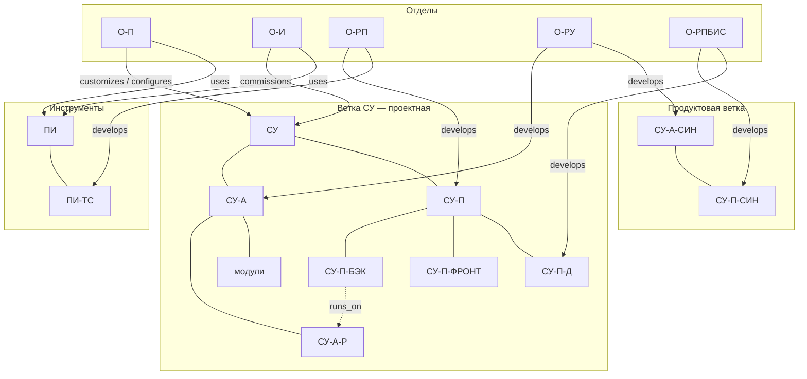

# Структура и работа компании

> Каноническая **модель компании**: типы сущностей → реестр → связи.  
> Первичная **база фактов** по компании.  
> Факт только. Неизвестное — в §5. Перестройка процесса — после полноты модели.

### Правила идентификаторов

- Кириллица, **ПРОПИСНЫЕ**, разделитель `-`, иерархия в пути ID.
- **Отделы** — плоские: `О-РП`, `О-РПИ`, `О-РПБИМ`… (без вложенности вроде `О-РП-О`).
- Инструменты — корень `ПИ-…` (не под `СУ-`, чтобы не путать с ПО на объекте).

---

## 0. Контекст фирмы

| Поле | Значение |
|------|----------|
| Отрасль | Автоматизация управления инженерными системами зданий, сооружений, территорий |
| Масштаб | 50+ сотрудников (в модели основных отделов — 35) |
| Роль разработки ПО | Не главное направление, критичное звено цепочки |

### Подходы к рынку (ветки)

| Ветка | Подход | Статус | Состав |
|-------|--------|--------|--------|
| **Проектная** | Реализация проектов автоматизации объектов | основной, текущий | СУ-А-Р, модули… + СУ-П-БЭК / СУ-П-ФРОНТ; ПИ |
| **Продуктовая** | Продукт для пользователя | создаётся, отдельно от проектной | **СУ-А-СИН** + **СУ-П-СИН** |

ID в одном пространстве имён `СУ-*`, но продуктовая ветка — **отдельный контур** (не в составе типового проекта СУ).

---

## 1. Типы сущностей (онтология)

| Тип | Код типа | Что означает | Примеры ID |
|-----|----------|--------------|------------|
| **Фирма** | Org | Компания в целом | (одна) |
| **Отдел** | Dept | Орг. единица | `О-П`, `О-РП`, `О-РУ` |
| **Продукт на объекте** | ProdSite | У заказчика | `СУ` |
| **Часть продукта** | ProdPart | Крупный срез | `СУ-А`, `СУ-П` |
| **Изделие** | Device | Аппаратное изделие (+ прошивка) | `СУ-А-Р`, `СУ-А-МДАЛИ`, `СУ-А-ДПО`, `СУ-А-СИН` |
| **Модуль ПО** | SoftModule | Часть ПО / приложение | `СУ-П-БЭК`, `СУ-П-СИН` |
| **Линейка инструментов** | ToolLine | ПО для ведения проектов | `ПИ` |
| **Инструмент** | Tool | Конкретный инструмент | `ПИ-ТС` |
| **Должность** | Role | Штатная должность (справочник) | `Д-ПРОГ`, `Д-ДИЗ`… |
| **Сотрудник** | Person | Человек в отделе | `С-АХ`, `С-ЮБ`… |
| **Внешнее** | External | Не наше изделие | свет, вентиляция |

**Ещё не введены:** конкретный проект объекта, заказчик, протокол, релиз.

---

## 2. Виды связей

| Связь | От → К | Смысл |
|-------|--------|-------|
| `part_of` | часть → целое | иерархия состава |
| `develops` | Dept → сущность | разрабатывает |
| `customizes` | Dept → продукт/часть | кастомизирует под заказчика |
| `configures` | Dept → состав СУ-А | определяет состав |
| `commissions` | Dept → СУ | пуско-наладка |
| `uses` | Dept → ПИ / инструмент | использует |
| `runs_on` | SoftModule → Device/среда | где исполняется |
| `connects_via` | Device → Device | Р ↔ оборудование через модули |
| `works_with` | приложение ↔ устройство | пользовательское ПО к изделию |
| `works_in` | Person → Dept | состоит в отделе |
| `holds` | Person → Role | занимает должность |
| `excludes` | СУ ↛ External | не наше изделие |

---

## 3. Реестр сущностей

### 3.0. Справочник должностей (`Д-…`)

> Перед сотрудниками. ID: `Д-<краткое>`, ПРОПИСНЫЕ.  
> Отдел в ID не зашиваем — связь должность↔отдел отдельно.

| ID | Название | Типичные отделы | Примечание |
|----|----------|-----------------|------------|
| **Д-ПРОГ** | Программист | О-РП, О-РПИ, О-РПБИМ, О-РПБИС, О-РУ | у О-РУ — прошивки |
| **Д-ТЕСТ** | Тестировщик | О-РП | |
| **Д-ПРОЕКТ** | Проектировщик | О-П | |
| **Д-ДИЗ** | Дизайнер | О-РПБИС | UI |
| **Д-ИНЖА** | Инженер по автоматизации | О-И | |
| **Д-КОНСТ** | Конструктор | О-РУ | |
| **Д-СХЕМ** | Схемотехник | О-РУ | |

### 3.1. Отделы (`Dept`)

Вспомогательные отделы вне модели. ID плоские.

| ID | Название | Чел. | Функция (факт) | Статус |
|----|----------|------|----------------|--------|
| **О-П** | Проектный | 8 | Кастомизация СУ-П; состав СУ-А; пользователь ПИ | ок |
| **О-И** | Инженерный | 8 | Пуско-наладка СУ; пользователь ПИ | ок |
| **О-РП** | Разработка ПО — Основной | 8 | СУ-П (БЭК, ФРОНТ) + ПИ-ТС; новый руководитель; в основном не ИИ-оптимисты | ок |
| **О-РПИ** | Разработка ПО — Инструментальный | 1 | Альтернатива ПИ-ТС: **ПИ-ЗС** (веб-стек, vibe-coding) | ок |
| **О-РПБИМ** | Разработка ПО — BIM | 1 | Программная платформа **З** — модели зданий из BIM → готовые для проектов СУ | ок |
| **О-РПБИС** | Разработка ПО — БИС | 2 | **СУ-П-СИН** (мобильное); **СУ-П-Д** (альтернатива БЭК/ФРОНТ: частичное перекрытие + новый функционал; веб, vibe-coding) | ок |
| **О-РУ** | Разработка устройств | 7 | Изделия СУ-А (в т.ч. **СУ-А-СИН**): железо + прошивки | ок |

### 3.1a. Сотрудники (`С-…`)

| ID | ФИО | Должность | Отдел | Примечание |
|----|-----|-----------|-------|------------|
| **С-АХ** | Алексей Х | Д-ПРОГ | О-РПБИС | |
| **С-ЮБ** | Юлия Б | Д-ДИЗ | О-РПБИС | |
| **С-АШ** | Александр Ш | Д-ПРОГ | О-РПИ | |
| **С-БК** | Богдан К | Д-ПРОГ | О-РПБИМ | |
| **С-ЕК** | Евгений К | Д-ИНЖА | О-И | |
| **С-ОИ-2** … **С-ОИ-8** | _(заглушка)_ | Д-ИНЖА | О-И | 7 чел., ФИО не детализируем |
| **С-ИШ** | Игорь Ш | Д-ПРОЕКТ | О-П | |
| **С-ОП-2** … **С-ОП-8** | _(заглушка)_ | Д-ПРОЕКТ | О-П | 7 чел., ФИО не детализируем |
| **С-ДС** | Денис С | Д-СХЕМ | О-РУ | |
| **С-РУ-2** … **С-РУ-7** | _(заглушка)_ | _разные_ | О-РУ | 6 чел., ФИО не детализируем |
| **С-АЧ** | Алексей Ч | Д-ПРОГ | О-РП | |
| **С-ВБ** | Владимир Б | Д-ПРОГ | О-РП | |
| **С-ВК** | Владимир К | Д-ПРОГ | О-РП | |
| **С-АП** | Алексей П | Д-ПРОГ | О-РП | |
| **С-ОГ** | Олег Г | Д-ПРОГ | О-РП | |
| **С-ДБ** | Даниил Б | Д-ПРОГ | О-РП | |
| **С-ЕД** | Елена Д | Д-ТЕСТ | О-РП | |
| **С-АС** | Анастасия С | Д-ТЕСТ | О-РП | |

### 3.2. Продукты и части — ветка СУ (проектная)

| ID | Тип | Описание | Где |
|----|-----|----------|-----|
| **СУ** | ProdSite | Система управления | объект |
| **СУ-А** | ProdPart | Аппаратная часть | объект |
| **СУ-П** | ProdPart | Программная часть | объект |
| **ПИ** | ToolLine | Инструменты для О-П и О-И | у О-П / О-И |
| **ПИ-ТС** | Tool | Базовый инструмент ПИ (давно в развитии) | у О-П / О-И; развивает **О-РП** |
| **ПИ-ЗС** | Tool | Альтернатива ПИ-ТС на веб-стеке (vibe-coding) | у О-П / О-И; развивает **О-РПИ** |

### 3.3. Изделия ветки СУ (`Device`, `part_of` СУ-А)

| ID | Описание | Примечание |
|----|----------|------------|
| **СУ-А-Р** | Центральный (полевой) контроллер | к оборудованию — в основном через модули |
| **СУ-А-МДАЛИ** | Модуль расширения DALI (освещение) | |
| **СУ-А-МАИ** | Модуль: аналоговые входы | |
| **СУ-А-МАО** | Модуль: аналоговые выходы | |
| **СУ-А-МДИ** | Модуль: дискретные входы | |
| **СУ-А-МДО** | Модуль: дискретные выходы | |
| **СУ-А-М…** | Другие модули расширения | перечень позже |
| **СУ-А-ДПО** | Датчик присутствия и освещённости | |
| **СУ-А-НПКС** | Настенная панель кнопочно-сенсорная | |

Прошивка изделия СУ-А — часть изделия, **не** СУ-П. Разрабатывает **О-РУ**.

### 3.4. Модули СУ-П (`SoftModule`)

| ID | Описание | Среда | Кто |
|----|----------|-------|-----|
| **СУ-П-БЭК** | Сервер | на СУ-А-Р **или** ПК Linux | **О-РП** |
| **СУ-П-ФРОНТ** | Клиент | ПК/mobile: Win, Linux, Android, iOS | **О-РП** |
| **СУ-П-Д** | Альтернатива БЭК/ФРОНТ на веб-стеке (vibe-coding): частично перекрывает старый функционал + добавляет новый | веб | **О-РПБИС** |

### 3.5. Продуктовая ветка: СУ-А-СИН + СУ-П-СИН

| ID | Тип | Описание | Кто |
|----|-----|----------|-----|
| **СУ-А-СИН** | Device | Устройство СИН | **О-РУ** |
| **СУ-П-СИН** | SoftModule | Мобильное приложение пользователя для работы с СУ-А-СИН | **О-РПБИС** |

```
СУ-А-СИН
СУ-П-СИН  ← works_with СУ-А-СИН
```

Отдельный контур от проектной связки СУ-А-Р / модули / СУ-П-БЭК / СУ-П-ФРОНТ.

### 3.6. Внешнее (`External`)

Не моделируем как изделия СУ: конечные устройства объекта (свет, вентиляция…); чужое оборудование в проектах.

---

## 4. Связи (факт)

### 4.1. Состав (`part_of`)

```
СУ
├── СУ-А
│   ├── СУ-А-Р
│   ├── модули: СУ-А-МДАЛИ, СУ-А-МАИ, СУ-А-МАО, СУ-А-МДИ, СУ-А-МДО, …
│   ├── СУ-А-ДПО, СУ-А-НПКС
│   └── … (+ при необходимости внешнее оборудование в проекте — не ID СУ)
└── СУ-П
    ├── СУ-П-БЭК / СУ-П-ФРОНТ  ← О-РП
    └── СУ-П-Д                 ← О-РПБИС (альтернатива: частичное перекрытие + новый функционал; веб, vibe-coding)

ПИ
└── ПИ-ТС

З   ← платформа О-РПБИМ: BIM-модели → готовые для проектов СУ

Продуктовый контур (не в типовом проекте):
СУ-А-СИН
СУ-П-СИН  ← works_with СУ-А-СИН
```

### 4.2. Отдел → продукт

| Отдел | Связь | Сущность |
|-------|-------|----------|
| О-П | `customizes` | СУ-П |
| О-П | `configures` | состав СУ-А |
| О-П | `uses` | ПИ (в т.ч. ПИ-ТС), З |
| О-И | `commissions` | СУ |
| О-И | `uses` | ПИ (в т.ч. ПИ-ТС) |
| О-РП | `develops` | СУ-П, СУ-П-БЭК, СУ-П-ФРОНТ |
| О-РП | `develops` | ПИ-ТС |
| О-РУ | `develops` | Device в СУ-А (в т.ч. СУ-А-СИН) |
| О-РПБИС | `develops` | СУ-П-СИН, СУ-П-Д |
| О-РПБИМ | `develops` | З |
| О-РПИ | — | не описаны |
### 4.3. Технические связи

| От | Связь | К |
|----|-------|---|
| СУ-П-БЭК | `runs_on` | СУ-А-Р (вариант) |
| СУ-П-БЭК | `runs_on` | ПК Linux (вариант) |
| СУ-П-ФРОНТ | `runs_on` | ПК/mobile пользователя |
| СУ-А-Р | `connects_via` | модули расширения |
| СУ-П-СИН | `works_with` | СУ-А-СИН |
| СУ-П-СИН | `runs_on` | мобильное устройство пользователя |
| СУ | `excludes` | External |

### 4.4. Цепочка проекта (проектная ветка)

```
Заказчик / объект
  → О-П: customizes(СУ-П) + configures(СУ-А); uses(ПИ)
  → О-И: commissions(СУ); uses(ПИ)
  → на объекте: СУ = СУ-А + СУ-П
```

### 4.5. Цепочка продукта (продуктовая ветка)

```
Пользователь
  → СУ-П-СИН (мобильное, О-РПБИС) works_with СУ-А-СИН (О-РУ)
```

---

## 5. Дыры модели

| Тема | Статус |
|------|--------|
| Функции — | (все основные отделы описаны) |
| Полный перечень модулей расширения (кроме известных М*) | позже |
| Шкафы комплектные | упомянуты; нет ID |
| Протоколы / драйверы | часть БЭК или отдельно? |
| Детали СУ-А-СИН / СУ-П-СИН (прошивка, платформы) | позже |

---

## 6. Карта


